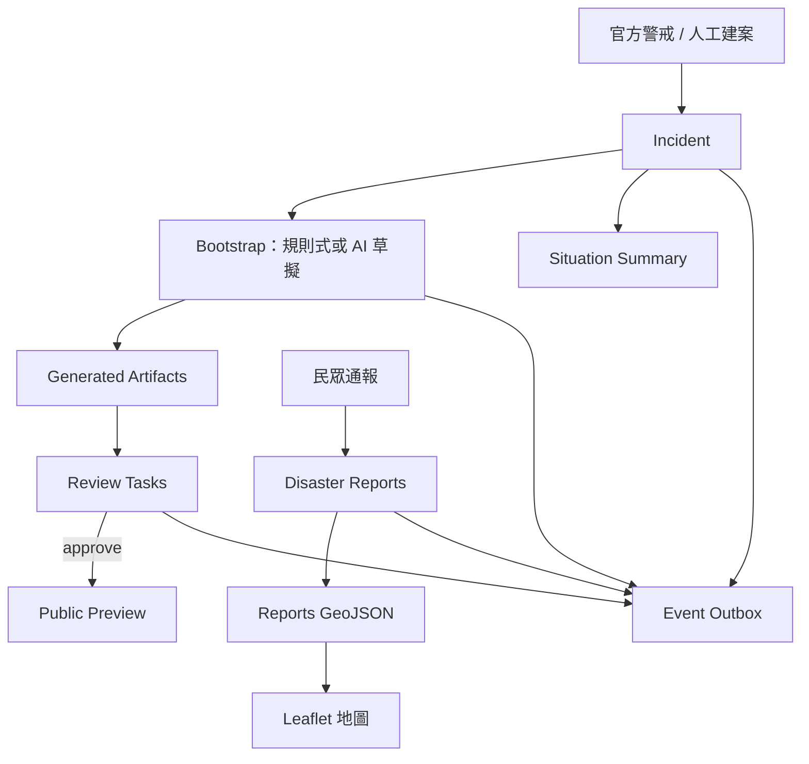

# 災鏈 ResQLink

[](https://github.com/edenfunf/disasterblock/actions/workflows/ci.yml)

災鏈 ResQLink 是一組可被其他防災系統重複使用的防災積木元件。它把一筆堰塞湖災害事件，轉成標準化的災害事件、救災元件、審核任務、民眾通報、GeoJSON 圖層與公開入口，讓不同團隊能快速拼接，縮短災害初期「資訊能被整理、審核並公開使用」所需的時間。

作品定位、問題描述與設計構想見 [SUBMISSION.md](./SUBMISSION.md)。

## 功能

- 接收官方警戒或人工建案，標準化為一筆災害事件（Incident）。支援堰塞湖、地震、颱風、水災等多種災別，元件內容隨災種自動調整。
- 由事件生成救災元件：預設生成六種核心元件（救災資訊入口、災情回報表單、志工報名、物資需求、地圖組合、公開公告），另有一組可選模組目錄（撤離指引、緊急求援、FB/LINE 擴散、物資看板、避難所地圖等），由人或後續的編排 Agent 選擇性生成。生成方式可選規則式或 AI 草擬。
- 每個元件預設為待審核，須由人工 approve / reject，通過後才可對外公開。
- 民眾提交災情通報並落地，輸出標準 GeoJSON 圖層（不含個資）；通報送出時**自動 triage 分流**（依需求類型與嚴重度判定 critical/high/normal/low）。
- 公開入口只顯示審核通過的內容。
- **需求-資源媒合**：登記志工/物資供給，與開放通報依類型與距離媒合，critical 優先。
- 情勢摘要：即時聚合元件、審核與通報狀態，呈現需求與分流分布；**事件時間軸**由 outbox 彙整完整稽核軌跡。
- 所有狀態變更寫入事件 outbox，供後續通知、派工或統計訂閱。

## 技術棧

- 後端：FastAPI、PostgreSQL、SQLAlchemy、Alembic
- 前端：Next.js、TypeScript、Tailwind CSS、Leaflet
- 容器：Docker Compose
- AI 草擬層（選用）：OpenAI

## 架構



詳細架構見 [docs/architecture.md](./docs/architecture.md)。

## 快速啟動

需求：已安裝 Docker 與 Docker Compose。

```bash
docker compose up --build
```

- 前端：<http://localhost:3000>
- API 與 Swagger：<http://localhost:8000/docs>

API 服務啟動時會自動執行 Alembic migration 建表。

若本機 3000 埠已被占用，改用 3001：

```bash
cp docker-compose.override.example.yml docker-compose.override.yml
docker compose up --build
```

前端會改在 <http://localhost:3001>。

### 啟用 AI 草擬（選用）

預設以規則式生成元件，不需任何金鑰即可完整運作。若要啟用 AI 草擬層：

```bash
cp .env.example .env
# 在 .env 填入 OPENAI_API_KEY，再重新啟動
```

啟用後，生成時帶 `?use_ai=true`（或在事件頁按「以 AI 生成」）即可由 AI 並行草擬部分文字欄位；產出仍須經人工審核才公開，且金鑰不會進入版本控制。

### 啟用真實對外連接器（選用）

對外發布預設走**模擬連接器**（記錄動作、不實際對外），方便 demo。填入憑證後即自動改走**真實 API**，沒填則維持模擬——皆**只發布審核通過**的內容（不繞過審核閘門）：

- **Facebook 粉專發文**：先建好粉專與 FB App，取得 Page Access Token，填 `FB_PAGE_ID` / `FB_PAGE_ACCESS_TOKEN`。
- **LINE 官方帳號推播**：LINE OA 啟用 Messaging API，填 `LINE_CHANNEL_ACCESS_TOKEN`。
- **Google 表單建立**：服務帳號 JSON 放到 `./secrets/`（已 git-ignore），填 `GOOGLE_SERVICE_ACCOUNT_FILE=/secrets/<檔名>`；可由表單元件**真的從 0 建出一份 Google 表單**。

各變數說明見 [.env.example](./.env.example)。注意：Facebook 粉專與 LINE OA 依平台政策需**人工先建立**，本系統負責後續的自動發布與管理；Google 表單則可由 API 真正從零建立。

## 載入展示資料

豐富版（建議，多筆完整事件）：

```bash
python client/seed_demo.py
```

會建立四筆不同災別的事件（堰塞湖／地震／颱風／水災），每筆生成全部救災元件，並灌入多筆民眾通報（含座標）、物資與志工登記、派工，讓每個成果後台與地圖都飽滿。若前端用 3001，前面加上 `WEB_BASE_URL=http://localhost:3001`。

精簡版（單一事件、示範審核流程）：

```bash
bash client/seed_demo.sh
```

> **Demo 模式**：預設 `DEMO_AUTO_APPROVE=true`，生成的元件會**直接上線**（略過人工審核），因此公開網站與各成果前台一建立就有內容。要恢復人工審核閘門，在 `.env` 設 `DEMO_AUTO_APPROVE=false` 後重啟。

## 測試

```bash
docker compose exec api pytest -q          # 後端整合測試
python scripts/validate_schemas.py         # JSON Schema 與範例（需先 pip install jsonschema）
```

提交前可一次跑完本機檢查：`bash scripts/preflight.sh`。

## API

| Method | Path | 說明 |
| --- | --- | --- |
| GET | `/v1/health` | 健康檢查 |
| POST | `/v1/events/alerts` | 接收警戒 / 建案，建立事件 |
| GET | `/v1/incidents` | 事件列表 |
| GET | `/v1/incidents/{id}` | 單筆事件 |
| POST | `/v1/bootstrap/incidents/{id}` | 生成救災元件 + 審核任務（省略 `module_ids` 生成該災種預設核心元件；帶 `?module_ids=` 可指定模組；`?use_ai=true` 啟用 AI 草擬） |
| GET | `/v1/connectors` | 開放資料連接器目錄（CWA 地震 / NCDR CAP / data.gov.tw） |
| POST | `/v1/connectors/{source}/ingest` | 以提供的官方 payload 映射建立事件 |
| POST | `/v1/connectors/{source}/demo` | 以內建範例警報建立事件（免金鑰） |
| POST | `/v1/connectors/{source}/sync` | 即時抓取官方資料建立事件（需授權碼） |
| GET | `/v1/modules` | 模組目錄（可依 `scenario` / `category` / `implemented` 篩選） |
| GET | `/v1/modules/categories` | 模組大方向（10 類） |
| GET | `/v1/modules/{id}` | 單一模組規格 |
| POST | `/v1/agent/plan` | 對話式編排：理解需求 → 標準化事件 → 提案模組（不生成） |
| POST | `/v1/agent/execute` | 生成選定模組（逐模組隔離失敗，產出一律待審核） |
| GET | `/v1/artifacts`、`/v1/artifacts/{id}` | 元件列表 / 內容 |
| POST | `/v1/artifacts/{id}/submissions` | 提交審核通過的生成表單（通用、config 驅動） |
| GET | `/v1/artifacts/{id}/submissions` | 表單提交列表（個資遮罩） |
| GET | `/v1/reviews` | 審核任務列表 |
| POST | `/v1/reviews/{id}/approve`、`/reject` | 審核通過 / 退回 |
| POST | `/v1/incidents/{id}/reports` | 提交民眾通報（送出時自動 triage 分流） |
| GET | `/v1/incidents/{id}/reports` | 通報列表（不含聯絡方式，含 triage 優先序） |
| GET | `/v1/reports/{id}` | 單筆通報（含個資，正式環境須權限控管） |
| POST | `/v1/reports/{id}/retriage` | 重新計算通報的 triage 優先序 |
| POST | `/v1/reports/{id}/verification` | 人工查證通報（verified / rejected / unverified） |
| GET | `/v1/incidents/{id}/reports.geojson` | 通報 GeoJSON（不含個資） |
| POST | `/v1/incidents/{id}/resources` | 登記資源（志工/物資） |
| GET | `/v1/incidents/{id}/resources` | 資源列表（不含聯絡方式） |
| GET | `/v1/incidents/{id}/matches` | 需求-資源媒合建議（critical 優先） |
| POST | `/v1/incidents/{id}/assignments` | 派工：將資源指派至通報需求 |
| GET | `/v1/incidents/{id}/assignments` | 派工列表 |
| PATCH | `/v1/assignments/{id}` | 更新派工狀態（assigned→in_progress→done/cancelled） |
| POST | `/v1/artifacts/{id}/publish` | 發布審核通過的對外元件（**設定憑證走真實 FB/LINE API，否則模擬**） |
| POST | `/v1/artifacts/{id}/google-form` | 由審核通過的表單元件**真實建立 Google 表單**（未設定憑證則模擬） |
| GET | `/v1/incidents/{id}/publications` | 發布記錄列表 |
| GET | `/v1/incidents/{id}/summary` | 情勢摘要（含 triage 分布與 critical 未結案數） |
| GET | `/v1/incidents/{id}/timeline` | 事件時間軸（由 outbox 彙整） |
| GET | `/v1/public/preview/{slug}` | 公開入口（僅審核通過內容） |
| GET | `/v1/events/outbox` | 事件 outbox |

完整合約見 Swagger（`/docs`）或匯出的 [openapi/](./openapi/)；各元件交換格式見 [schemas/](./schemas/)。

## 前端頁面

| 路由 | 用途 |
| --- | --- |
| `/` | 首頁 |
| `/console` | 事件列表 |
| `/console/agent` | 對話式 AI 編排（描述災害 → 提案模組 → 平行生成） |
| `/console/modules` | 模組目錄（依十大方向分類，標示型別/實作狀態/端點） |
| `/console/connectors` | 開放資料介接（一鍵匯入官方範例警報 → 事件） |
| `/console/new` | 建立事件 |
| `/console/reviews` | 審核 |
| `/incidents/[id]` | 事件詳細：生成、審核、通報、情勢摘要 |
| `/preview/[slug]` | 公開入口與地圖 |
| `/reports/[incidentId]` | 民眾通報表單、志工/物資登記與地圖 |

## 目錄結構

```
disasterblock/
├── apps/
│   ├── api/                FastAPI 後端
│   │   ├── app/{routers,schemas,services,db,core,utils}/
│   │   ├── alembic/        資料庫 migration
│   │   └── tests/          pytest
│   └── web/                Next.js 前端
│       ├── app/            頁面
│       ├── components/     元件
│       └── lib/            API client 與型別
├── schemas/                元件交換格式 JSON Schema
├── openapi/                OpenAPI 匯出
├── samples/                範例輸入
├── client/                 煙霧測試與展示資料腳本
├── scripts/                schema 驗證、preflight 等
├── docs/                   架構與設計文件
└── docker-compose.yml
```

## AI 使用與資料倫理

預設以規則式生成，可預測、可重現、可稽核。啟用 AI 時，AI 僅並行草擬部分自由文字欄位（公告、入口標題、表單引導語），表單結構與風險分級仍由規則產生；AI 產出一律須經人工審核才公開，民眾個資不會送入模型，失敗時自動退回規則式。對外輸出（GeoJSON、公開入口）一律去識別化。本系統為公民科技輔助工具，不取代官方災害應變指揮與公告。完整聲明見 [SECURITY_AND_LIMITATIONS.md](./SECURITY_AND_LIMITATIONS.md)。

## 文件

- [SUBMISSION.md](./SUBMISSION.md)　作品定位、問題描述與驗收路徑
- [SECURITY_AND_LIMITATIONS.md](./SECURITY_AND_LIMITATIONS.md)　資料倫理與限制
- [docs/architecture.md](./docs/architecture.md)　系統架構
- [docs/demo-script.md](./docs/demo-script.md)　展示腳本

## 授權

MIT，見 [LICENSE](./LICENSE)。
