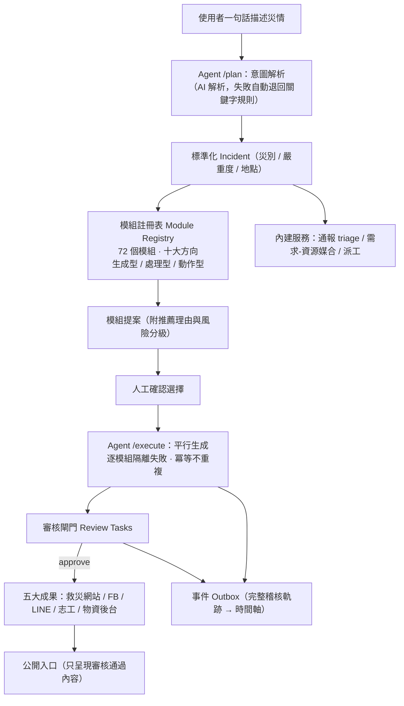

# 災鏈 ResQLink

[](https://github.com/edenfunf/disasterblock/actions/workflows/ci.yml)

| | |
| --- | --- |
| 參與競賽 | [防災積木元件創新賽：公民科技拼出韌性臺灣](https://civictech.moda.gov.tw/) |
| 主辦單位 | 數位發展部 |
| 競賽成績 | 🏆 **優勝** |

**一句話描述災情，AI Agent 從防災積木目錄找出該用的模組，平行生成一整套救災系統。**

災害初期最缺的不是工具，而是「把工具組起來的時間」。災鏈 ResQLink 把救災需要的能力
拆成一顆顆標準化的防災積木（模組），建立一份機器可讀的模組註冊表，再由 AI Agent
擔任編排者：理解一句自然語言的災情描述、判斷災別、從註冊表挑出適用的模組提案給人確認，
確認後平行生成，產出救災資訊網站、災情通報、志工與物資後台、FB/LINE 擴散內容等成果。
所有 AI 產出都經過審核閘門才對外公開。

支援堰塞湖、地震、颱風、水災等災別，模組內容隨災種自動調整。

## 整體架構



設計上刻意把 LLM 限制在單一決策點：Agent 只負責「理解需求、提出模組建議」，
實際生成一律走註冊表登記的確定性程式，內容可預測、可重現、可稽核。
AI 不可用時自動退回關鍵字規則，整條流程不依賴外部服務也能完整運作。

## 核心概念

**模組註冊表（Module Registry）**
每個模組是一份 `ModuleSpec`：id、名稱、適用災別、型別（生成型／處理型／動作型）、
風險分級、是否需審核、服務端點。目前收錄 72 個模組、分為十大方向
（資訊匯流、災情蒐集、求援、擴散、志工、物資、媒合、地理態勢、查證、協調）。
已實作的模組可直接由 Agent 生成或已有服務端點；規劃中的模組先登記規格，
目錄本身就是路線圖。前端 `/console/modules` 可瀏覽完整能力地圖。

**Agent 編排（plan / execute 兩階段）**
`/v1/agent/plan` 解析災情描述、建立或沿用事件、依災別從註冊表提案模組並附推薦理由；
`/v1/agent/execute` 生成人工選定的模組。兩階段中間隔著人的確認，Agent 不會自行動手。
執行時逐模組隔離：單一模組失敗不影響其他模組，重複執行只補缺不重複生成。

**審核閘門**
所有生成物預設 `pending_review`，人工核准後才進公開入口。展示模式
（`DEMO_AUTO_APPROVE=true`）會自動核准以便評審操作，正式使用時關閉即恢復人工審核。

## 功能

- 官方警戒（CWA 地震、NCDR CAP、data.gov.tw）或人工建案，標準化為災害事件。
- Agent 對話式編排：描述災情、提案模組、平行生成，前端 `/console/agent` 一句話跑完全流程。
- 民眾災情通報自動 triage 分流（critical/high/normal/low），輸出去識別化 GeoJSON 圖層。
- 需求-資源媒合：志工與物資登記後，依需求類型與距離對開放通報配對，critical 優先；可派工並追蹤狀態。
- 對外發布走連接器：填入憑證即真實發布 FB 貼文、LINE 推播、從零建立 Google 表單；未填憑證自動改走模擬連接器，皆只發布審核通過的內容。
- 情勢摘要與事件時間軸：由事件 outbox 彙整完整稽核軌跡。
- 網站 AI 助手：可詢問系統功能與即時資料現況（無金鑰時退回知識庫回答）。

## 技術棧

後端 FastAPI + PostgreSQL + SQLAlchemy + Alembic；前端 Next.js + TypeScript +
Tailwind CSS + Leaflet；Docker Compose 容器化；AI 層（選用）OpenAI。

## 快速啟動

需求：Docker 與 Docker Compose。

```bash
cp .env.example .env      # 至少填 POSTGRES_PASSWORD
docker compose up --build
```

- 前端：<http://localhost:3000>
- API 與 Swagger：<http://localhost:8000/docs>

API 啟動時自動執行 Alembic migration。若 3000 埠被占用，
`cp docker-compose.override.example.yml docker-compose.override.yml` 後改走 3001。

### 啟用 AI 層（選用）

預設規則式生成，免金鑰可完整運作。在 `.env` 填 `OPENAI_API_KEY` 後：
Agent 的意圖解析改由 AI 判讀、生成時可帶 `?use_ai=true` 由 AI 草擬文字欄位、
網站助手改用 AI 回答。AI 產出仍須經審核閘門，失敗自動退回規則式。

### 啟用真實對外連接器（選用）

| 連接器 | 需要的設定 | 說明 |
| --- | --- | --- |
| Facebook 粉專發文 | `FB_PAGE_ID`、`FB_PAGE_ACCESS_TOKEN` | 粉專與 FB App 需先人工建立 |
| LINE 官方帳號推播 | `LINE_CHANNEL_ACCESS_TOKEN` | LINE OA 啟用 Messaging API |
| Google 表單 | `GOOGLE_SERVICE_ACCOUNT_FILE`（金鑰放 `./secrets/`，已 git-ignore） | 可由表單元件真實從零建立 Google 表單 |

未設定憑證時自動走模擬連接器（記錄動作、不實際對外），demo 不受影響。

### 存取控制（選用）

設定 `ADMIN_API_KEY` 後，除公開災民端點（健康檢查、公開網站、通報與資源登錄）外，
所有 API 需帶 `X-API-Key` 標頭。展示模式不設定即維持開放。

## 載入展示資料

```bash
python client/seed_demo.py     # 四筆不同災別事件 + 全部模組 + 通報/物資/志工/派工
bash  client/seed_demo.sh      # 精簡版：單一事件，示範審核流程
```

## 測試

```bash
docker compose exec api pytest -q      # 後端整合測試（含 Agent plan/execute、審核閘門）
python scripts/validate_schemas.py     # JSON Schema 與範例驗證
bash scripts/preflight.sh              # 提交前一次跑完本機檢查
```

## API

| Method | Path | 說明 |
| --- | --- | --- |
| POST | `/v1/agent/plan` | Agent 編排：理解災情描述 → 標準化事件 → 提案模組（不生成） |
| POST | `/v1/agent/execute` | 生成選定模組（逐模組隔離失敗，產出一律進審核） |
| GET | `/v1/modules` | 模組註冊表（可依 `scenario` / `category` / `implemented` 篩選） |
| GET | `/v1/modules/categories` | 十大方向 |
| GET | `/v1/modules/{id}` | 單一模組規格 |
| POST | `/v1/events/alerts` | 接收警戒 / 建案，建立事件 |
| GET | `/v1/incidents`、`/v1/incidents/{id}` | 事件列表 / 單筆 |
| POST | `/v1/bootstrap/incidents/{id}` | 生成救災元件（可指定 `module_ids`、`?use_ai=true`） |
| GET | `/v1/connectors` ＋ `/ingest` `/demo` `/sync` | 官方開放資料介接 |
| GET | `/v1/artifacts`、`/v1/artifacts/{id}` | 生成物列表 / 內容 |
| GET | `/v1/reviews`；POST `/approve` `/reject` | 審核閘門 |
| POST/GET | `/v1/incidents/{id}/reports` | 民眾通報（送出自動 triage；列表不含個資） |
| GET | `/v1/incidents/{id}/reports.geojson` | 通報圖層（去識別化） |
| POST | `/v1/reports/{id}/retriage`、`/verification` | 重新分流 / 人工查證 |
| POST/GET | `/v1/incidents/{id}/resources` | 志工 / 物資登記 |
| GET | `/v1/incidents/{id}/matches` | 需求-資源媒合建議（critical 優先） |
| POST/GET/PATCH | `/v1/incidents/{id}/assignments`、`/v1/assignments/{id}` | 派工與狀態追蹤 |
| POST | `/v1/artifacts/{id}/publish`、`/google-form` | 對外發布（有憑證走真實 API，否則模擬） |
| GET | `/v1/incidents/{id}/summary`、`/timeline` | 情勢摘要 / 事件時間軸 |
| POST | `/v1/assistant/chat` | 網站 AI 助手 |
| GET | `/v1/public/preview/{slug}` | 公開入口（僅審核通過內容） |

完整合約見 Swagger（`/docs`）或 [openapi/](./openapi/)；交換格式見 [schemas/](./schemas/)。

## 前端頁面

| 路由 | 用途 |
| --- | --- |
| `/console/agent` | Agent 編排：描述災情 → 模組提案 → 平行生成 → 五大成果 |
| `/console/modules` | 模組註冊表目錄（十大方向、型別、實作狀態） |
| `/console` | 跨事件總覽 |
| `/console/connectors` | 官方開放資料介接 |
| `/console/reviews` | 集中審核 |
| `/incidents/[id]` | 事件詳情：生成、審核、通報、情勢摘要、時間軸 |
| `/incidents/[id]/site`・`/fb`・`/line`・`/volunteer`・`/supply` | 五大成果的管理後台 |
| `/preview/[slug]` | 公開救災資訊網站（地圖、公告、避難資訊） |
| `/reports/[incidentId]` | 民眾通報與志工 / 物資登記 |

## 目錄結構

```
disasterblock/
├── apps/
│   ├── api/                       FastAPI 後端
│   │   ├── app/modules/           模組註冊表：ModuleSpec、十大方向、72 個模組
│   │   ├── app/services/          agent_orchestrator（plan/execute）、bootstrap、
│   │   │                          triage、媒合、派工、發布、AI 層
│   │   ├── app/{routers,schemas,db,core}/
│   │   ├── alembic/               資料庫 migration
│   │   └── tests/                 pytest（含 Agent 編排整合測試）
│   └── web/                       Next.js 前端
├── schemas/                       元件交換格式 JSON Schema
├── openapi/                       OpenAPI 匯出
├── client/                        展示資料腳本
├── scripts/                       schema 驗證、preflight
└── docs/                          架構與設計文件
```

## AI 使用與資料倫理

LLM 只在三處使用且都可退回規則式：Agent 意圖解析、文字欄位草擬、網站助手。
表單結構與風險分級一律由規則產生；AI 產出須經人工審核才公開；民眾個資不送入模型；
對外輸出（GeoJSON、公開入口）一律去識別化。本系統為公民科技輔助工具，
不取代官方災害應變指揮與公告。完整聲明見
[SECURITY_AND_LIMITATIONS.md](./SECURITY_AND_LIMITATIONS.md)。

## 文件

- [SUBMISSION.md](./SUBMISSION.md)　作品定位、問題描述與驗收路徑
- [docs/architecture.md](./docs/architecture.md)　系統架構
- [docs/demo-script.md](./docs/demo-script.md)　展示腳本
- [SECURITY_AND_LIMITATIONS.md](./SECURITY_AND_LIMITATIONS.md)　資料倫理與限制

## 授權

MIT，見 [LICENSE](./LICENSE)。
