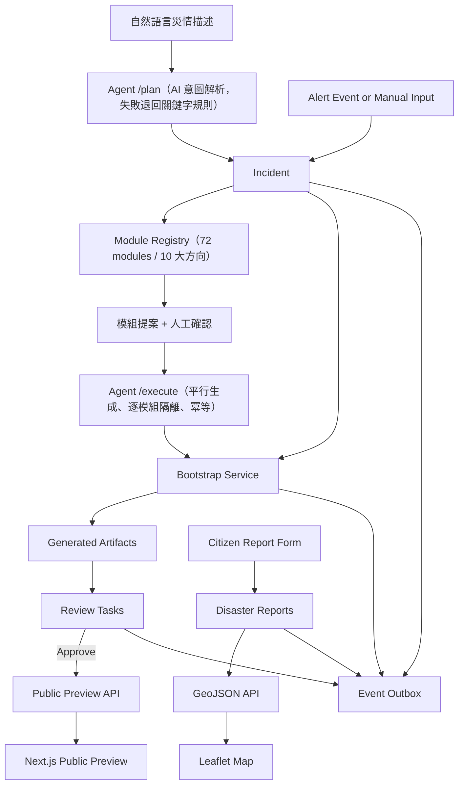
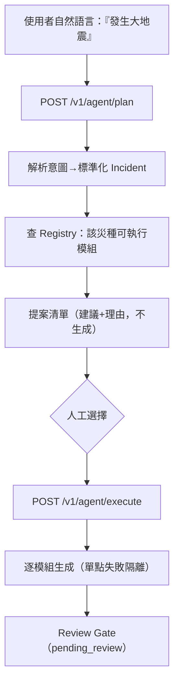
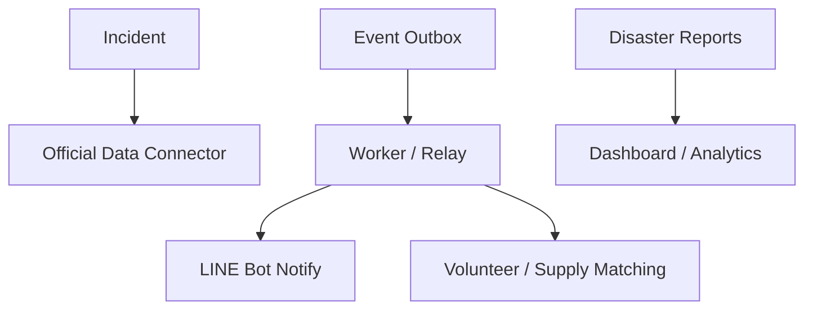

# 災鏈 ResQLink — 系統架構

> GitHub 可直接渲染本頁的 Mermaid 圖。

## 1. 系統總覽

災鏈 ResQLink 的核心是 **AI Agent 編排器＋模組註冊表**：一句自然語言的災情描述，
由 Agent 解析成標準化事件，從 72 個模組的註冊表挑出適用的防災積木提案給人確認，
確認後平行生成，經審核閘門輸出成可被其他系統拼接的標準格式
（Incident / Artifacts / Reports / GeoJSON / Public Preview）。
支援堰塞湖、地震、颱風、水災等災別，模組內容隨災種調整。

三個容器（Docker Compose）：

| service | 內容 | port |
| --- | --- | --- |
| `db` | PostgreSQL 16 | 5432 |
| `api` | FastAPI 後端 | 8000 |
| `web` | Next.js 前端 | 3000 |

## 2. 端到端架構圖



## 3. 能力與產物對應

| 能力 | 主要產物 |
| --- | --- |
| 事件接收與標準化 | `incidents`、`event_outbox` |
| Agent 編排（作品核心） | agent orchestrator（plan / execute）、意圖解析（AI + 關鍵字 fallback） |
| 生成救災元件 + 人工審核 | `generated_artifacts`、`review_tasks`、模組註冊表（72 模組：生成型 50／處理型 20／動作型 2） |
| 民眾通報 + 自動分流 + GeoJSON + 公開 Preview | `disaster_reports`（triage）、reports.geojson、public preview |
| 需求-資源媒合 | `resource_offers`、matching engine、`/matches` |
| 情勢摘要 + 時間軸 + 可操作前端 | situation summary、timeline、Next.js + Leaflet |

## 4. 後端分層

```
apps/api/app/
├── routers/    # HTTP 介面、參數驗證、錯誤碼（FastAPI）
├── schemas/    # Pydantic v2 Request / Response 型別（含 Enum、validator）
├── services/   # 商業邏輯與交易邊界（單一 transaction commit）
└── db/         # SQLAlchemy 2.x models + engine / session
```

- **routers** 不寫商業邏輯，只負責 HTTP 與錯誤對應（404 / 400 / 422 / 500）。
- **services** 擁有交易邊界：例如 `bootstrap_service` 在同一交易內建立 artifacts + review_tasks + outbox event。
- **schemas** 是元件對外的「合約」，與 [`schemas/*.json`](../schemas/)（精簡 JSON Schema）與
  [OpenAPI](../openapi/) 對應。

## 5. 核心資料流

### 5.1 事件 → 公開

```
Alert Event → Incident → Bootstrap → Generated Artifacts → Review Tasks
            → (Approve) → Public Preview API → Next.js Public Preview
```

### 5.2 通報 → 地圖

```
Citizen Report Form → disaster_reports → GeoJSON API → Leaflet Map
```

通報落地時保留 `raw_payload`（原始輸入）；GeoJSON 只輸出有座標者，且**不含 PII**。

## 6. Transactional Outbox Pattern

所有領域事件（`incident.created`、`incident.bootstrapped`、`artifact.approved` /
`artifact.rejected`、`disaster_report.created`）都與業務資料**在同一個資料庫交易內**寫入
`event_outbox`。


好處：業務成功則事件必定存在（不漏事件、不雙寫不一致），且為未來的 worker / relay 預留接點
（`processed` / `processed_at` 欄位）。

## 7. approved-only Public Preview

- 每個 artifact 預設 `pending_review`，採白名單式公開。
- `GET /v1/public/preview/{slug}` **只回 `status = approved`** 的 artifacts，
  不回 review tasks、不回任何 reporter PII。
- 前端公開頁完全信任此規則，畫面有什麼由後端 approve 與否決定，**無法繞過**。

## 8. 為什麼是「防災積木元件」而不是單一平台

- 每個輸出都有**標準格式 + JSON Schema + OpenAPI**，可被外部系統獨立取用。
- 前端只是其中一種「外框」；換成政府 GIS、其他網站、QGIS 也能直接吃同一份 GeoJSON / API。
- 後端以**事件驅動 + 交易 outbox** 設計，方便其他系統訂閱、擴充，而非綁死單一 UI。

這些 `schemas/*.json` 即是**元件交換格式**：讓民間團隊、政府系統或後續平台不必讀完整碼，
也能知道每個積木的 Input / Output 形狀。

## 8.5 模組註冊表（Module Registry）與多災種

生成元件不再寫死，而是收斂為一份 **模組註冊表**（[`app/modules/`](../apps/api/app/modules/)）：

- 每個模組是一份標準 `ModuleSpec`（`id / name / category / module_type / applicable_scenarios /
  default_enabled / implemented / risk / review_type / generate`），`id` 同時即 artifact_type。
- 目前共 **72 個模組**：**生成型（generator）50 個**，全部可由 Agent／bootstrap 直接生成
  可審核的草稿（表單 / 公告 / 貼文 / 地圖設定）；**處理型（processor）20 個**與
  **動作型（action）2 個**，已實作者登記其服務端點（如媒合引擎、triage、派工、對外發布），
  規劃中的標 `implemented=False` 作為路線圖，不假裝已存在。合計已實作 57、規劃中 15。
- 模組依十個大方向（資訊匯流、通報、求援、擴散、志工、物資、媒合、地理態勢、查證、協調）分類，
  可由 `GET /v1/modules` 查詢，前端 `/console/modules` 提供完整能力地圖。

**多災種**：各災別的需求類型、物資品項、志工技能與用語收進
[`scenarios.py`](../apps/api/app/modules/scenarios.py) 的 `ScenarioProfile`。同一個模組對堰塞湖、
地震、颱風、水災都適用，內容隨 `incident.scenario_type` 切換；新增一種災害是新增一份 profile，
而非改程式。

**Bootstrap 兩種模式（Agent 編排的接點）**：

```
POST /v1/bootstrap/incidents/{id}                    → 生成該災種的 default_enabled 核心模組（向後相容）
POST /v1/bootstrap/incidents/{id}?module_ids=a&module_ids=b → 只生成選定模組（人或編排 Agent 選擇）
```

Bootstrap **逐模組冪等**：已存在的元件略過、不重生；未知或未實作的模組回 400。

## 8.6 對話式編排 Agent（Planner-Orchestrator）

在 Registry 之上的 **編排 Agent** 是系統唯一的 LLM 決策點（[`agent_orchestrator.py`](../apps/api/app/services/agent_orchestrator.py)），
刻意拆成兩階段，讓「理解」與「生成」之間有人工確認：



- **意圖解析**：優先用 AI（[`ai_agent.parse_intent`](../apps/api/app/services/ai_agent.py)）抽出
  `scenario_type / 地點 / 嚴重度`；無金鑰或失敗時退化為關鍵字判斷，流程不中斷。
- **提案**：建議集 = 該災種預設核心模組 + 規則式情境建議，並附推薦理由（可解釋）；
  只提案 `implemented` 的 generator 模組。
- **執行**：逐模組獨立生成，單一模組失敗（如未實作）不影響其餘，回報每個模組的
  created / skipped / failed。
- **守則**：Agent 只輸出「呼叫哪些模組」的決策，**不直接寫資料、不直接公開**；
  產出一律進審核閘門，全程寫 `event_outbox`（`agent.planned` / `agent.executed`）。

## 9. 可擴充點（保留接口，本階段不實作）



- **official data connector**：把 `source_refs` 接上真實官方警戒 API（目前僅保留欄位，未串接）。
- **worker / outbox relay**：背景消費 `event_outbox`（目前 outbox 為同步寫入、按需讀取）。
- **真實社群 connector**：把 publication 的模擬連接器換成真實 Facebook / LINE API（需憑證）。

> 已實作（曾為擴充點）：**需求-資源媒合**（`needs_matching_engine` → `/matches`）、
> **志工/資源派遣與追蹤**（`volunteer_dispatch` → `/assignments`）、
> **對外發布**（`fb_publish_action` / `line_broadcast_action` → `/artifacts/{id}/publish`，
> 目前為**模擬連接器**，未實際發文）、**情勢統計與時間軸**（summary / timeline）。
>
> 註：本專案**未**串接任何真實官方 API 或真實社群平台；`source_refs` 與真實 connector 為預留擴充點。
