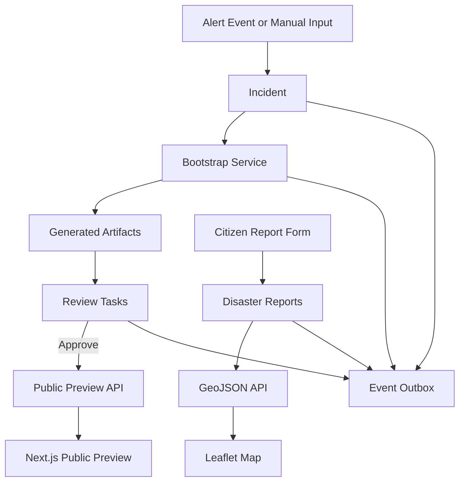
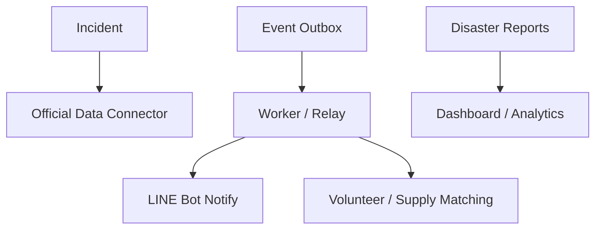

# DisasterBlock — 系統架構

> GitHub 可直接渲染本頁的 Mermaid 圖。

## 1. 系統總覽

DisasterBlock 是一組**防災積木元件**：把堰塞湖災害事件，經過「標準化 → 生成 → 審核 → 公開 / 通報」
的資料流，輸出成可被其他系統拼接的標準格式（Incident / Artifacts / Reports / GeoJSON / Public Preview）。

三個容器（Docker Compose）：

| service | 內容 | port |
| --- | --- | --- |
| `db` | PostgreSQL 16 | 5432 |
| `api` | FastAPI 後端 | 8000 |
| `web` | Next.js 前端 | 3000 |

## 2. 端到端架構圖



## 3. 能力與產物對應

| 能力 | 主要產物 |
| --- | --- |
| 事件接收與標準化 | `incidents`、`event_outbox` |
| 生成救災元件 + 人工審核 | `generated_artifacts`、`review_tasks` |
| 民眾通報 + GeoJSON + 公開 Preview | `disaster_reports`、reports.geojson、public preview |
| 情勢摘要與可操作前端 | situation summary、Next.js + Leaflet |

## 4. 後端分層

```
apps/api/app/
├── routers/    # HTTP 介面、參數驗證、錯誤碼（FastAPI）
├── schemas/    # Pydantic v2 Request / Response 型別（含 Enum、validator）
├── services/   # 商業邏輯與交易邊界（單一 transaction commit）
└── db/         # SQLAlchemy 2.x models + engine / session
```

- **routers** 不寫商業邏輯，只負責 HTTP 與錯誤對應（404 / 400 / 422 / 500）。
- **services** 擁有交易邊界：例如 `bootstrap_service` 在同一交易內建立 artifacts + review_tasks + outbox event。
- **schemas** 是元件對外的「合約」，與 [`schemas/*.json`](../schemas/)（精簡 JSON Schema）與
  [OpenAPI](../openapi/) 對應。

## 5. 核心資料流

### 5.1 事件 → 公開

```
Alert Event → Incident → Bootstrap → Generated Artifacts → Review Tasks
            → (Approve) → Public Preview API → Next.js Public Preview
```

### 5.2 通報 → 地圖

```
Citizen Report Form → disaster_reports → GeoJSON API → Leaflet Map
```

通報落地時保留 `raw_payload`（原始輸入）；GeoJSON 只輸出有座標者，且**不含 PII**。

## 6. Transactional Outbox Pattern

所有領域事件（`incident.created`、`incident.bootstrapped`、`artifact.approved` /
`artifact.rejected`、`disaster_report.created`）都與業務資料**在同一個資料庫交易內**寫入
`event_outbox`。


好處：業務成功則事件必定存在（不漏事件、不雙寫不一致），且為未來的 worker / relay 預留接點
（`processed` / `processed_at` 欄位）。

## 7. approved-only Public Preview

- 每個 artifact 預設 `pending_review`，採白名單式公開。
- `GET /v1/public/preview/{slug}` **只回 `status = approved`** 的 artifacts，
  不回 review tasks、不回任何 reporter PII。
- 前端公開頁完全信任此規則，畫面有什麼由後端 approve 與否決定，**無法繞過**。

## 8. 為什麼是「防災積木元件」而不是單一平台

- 每個輸出都有**標準格式 + JSON Schema + OpenAPI**，可被外部系統獨立取用。
- 前端只是其中一種「外框」；換成政府 GIS、其他網站、QGIS 也能直接吃同一份 GeoJSON / API。
- 後端以**事件驅動 + 交易 outbox** 設計，方便其他系統訂閱、擴充，而非綁死單一 UI。

這些 `schemas/*.json` 即是**元件交換格式**：讓民間團隊、政府系統或後續平台不必讀完整碼，
也能知道每個積木的 Input / Output 形狀。

## 9. 可擴充點（保留接口，本階段不實作）



- **LINE Bot**：消費 outbox 事件做推播 / 收通報（目前不接）。
- **official data connector**：把 `source_refs` 接上真實官方警戒 API（目前僅保留欄位，未串接）。
- **worker / outbox relay**：背景消費 `event_outbox`。
- **matching**：志工 / 物資與需求媒合。
- **dashboard**：依 need_type / severity / status 的災情統計。

> 註：本專案**未**串接任何真實官方 API；`source_refs` 與 connector 為預留擴充點。
